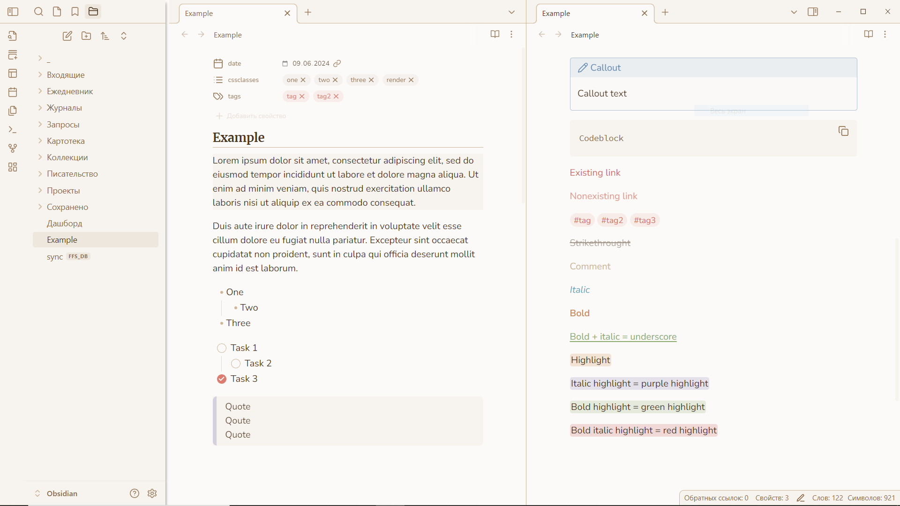

# Creme brulee

This theme was designed to look minimalistic, but cozy, with soft colors and many little adjustments.

## Extra formattings

This theme changes some of the standart markdown formattings appearance, so you can add colors to your notes without using html. I tried to do this without breaking semantic meanings of the tags. Just remember this colors will only appear in Obsidian, and will not be preserved if you want to export your notes.

## Cssclasses

This theme contains some cssclasses that allow you to hide some elements from the specific notes while keeping them in the others. Just add one of these values to your cssclasses property:

- hide-inline-title
- hide-backlinks
- hide-properties

## Layout adjustments

To make notes look cleaner I removed the properties heading, and the properties fold button is only revealed on hover. 

On mobile I removed the button to open the left sidebar, because the sidebar can be opened with the swipe. The button now is only visible in the canvas view.

I also made empty lines between paragraphs appear narrower in live preview.

There are lot of others little tweaks and there is more to come. I made this theme for myself and try to keep it lightweight, so probably no settings will be added, but we'll see.